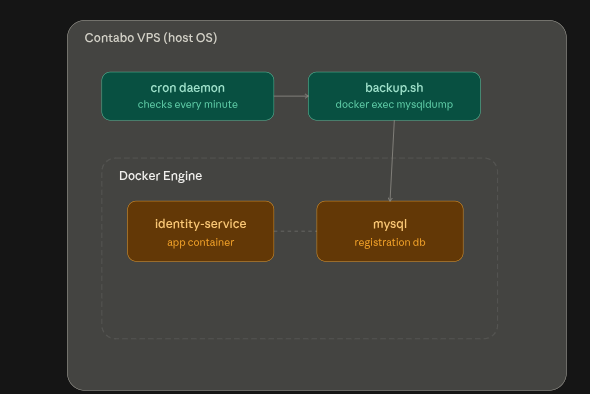
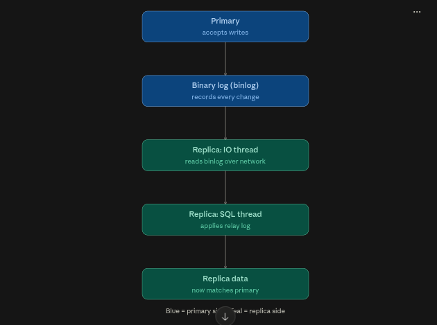

# DB Ops — MySQL Backup & Restore Lab

A standalone, disposable project for practicing database backup and restore mechanics with Docker, before applying the same concepts to the ledger project's real database. Kept fully separate from the rate limiter project, own network, own volume, own lifecycle.



## What backup vs replication actually are

- **Backup** — a static, point-in-time snapshot. Captures exactly what existed the moment you took it, nothing after. Protects against mistakes: bad `DELETE`, broken migration, corrupted disk, restore from before it happened.
- **Replication** — a live, continuously-updated copy running on a separate instance, streaming every change from a primary to one or more replicas. Protects against a server dying, not against your own mistakes, a `DROP TABLE` on the primary replicates too.

This doc covers backup first, replication is a separate follow-up once this is second nature.

## docker-compose.yml

```yaml
services:
  mysql:
    image: mysql:8.0
    container_name: dbops_mysql
    restart: unless-stopped
    environment:
      MYSQL_ROOT_PASSWORD: rootpass
      MYSQL_DATABASE: ledger_lab
      MYSQL_USER: ledger_user
      MYSQL_PASSWORD: ledger_pass
    ports:
      - "3306:3306"
    volumes:
      - dbops_mysql_data:/var/lib/mysql
    networks:
      - dbops-network

volumes:
  dbops_mysql_data:

networks:
  dbops-network:
    driver: bridge
```

The named volume (`dbops_mysql_data`) is what makes data survive container restarts/removal, without it, everything lives only in the container's writable layer and vanishes with `docker compose down -v`.

## 1. Start the container

```bash
docker compose up -d
```

`up` starts every service in the file. `-d` runs it detached, in the background, instead of blocking your terminal with live logs.

## 2. Confirm it's running and ready

```bash
docker compose ps
```

Scoped to *this* project only (unlike plain `docker ps`, which lists every container on the machine regardless of which compose file started it).

```bash
docker compose logs -f mysql
```

Follow logs live until you see `ready for connections`, MySQL does first-time initialization on its first ever start, which takes a few seconds. `Ctrl+C` to stop watching (container keeps running).

## 3. Connect to the MySQL shell

```bash
docker exec -it dbops_mysql mysql -u root -p
```

- `docker exec` runs a command inside an already-running container.
- `-i` keeps stdin open (so you can type), `-t` allocates a terminal (so it behaves interactively). Both needed for a usable shell session.
- `-p` with nothing directly after it prompts for the password interactively. Password: `rootpass`.

## 4. Create tables

```sql
USE ledger_lab;

CREATE TABLE accounts (
    id INT PRIMARY KEY AUTO_INCREMENT,
    name VARCHAR(50) NOT NULL,
    balance DECIMAL(10,2) NOT NULL DEFAULT 0
);

CREATE TABLE transactions (
    id INT PRIMARY KEY AUTO_INCREMENT,
    account_id INT NOT NULL,
    amount DECIMAL(10,2) NOT NULL,
    type VARCHAR(10) NOT NULL,
    created_at TIMESTAMP DEFAULT CURRENT_TIMESTAMP,
    FOREIGN KEY (account_id) REFERENCES accounts(id)
);
```

- `DECIMAL(10,2)`, not `FLOAT`, for money. Floats can't represent every decimal value exactly; decimals are exact fixed-point.
- `FOREIGN KEY` enforces that every `account_id` in `transactions` must correspond to a real row in `accounts`, the database rejects orphaned references itself.

## 5. Insert sample data

```sql
INSERT INTO accounts (name, balance) VALUES ('alice', 100.00), ('bob', 50.00);

INSERT INTO transactions (account_id, amount, type) VALUES
    (1, 100.00, 'deposit'),
    (2, 50.00, 'deposit');
```

## 6. Verify

```sql
SELECT * FROM accounts;

SELECT accounts.name, transactions.amount, transactions.type, transactions.created_at
FROM transactions
JOIN accounts ON transactions.account_id = accounts.id;
```

`exit;` to leave the shell.

## 7. Take a backup

```bash
docker exec dbops_mysql mysqldump -u root -prootpass ledger_lab > backup.sql
```

No `-it`, this is a single non-interactive command. `mysqldump` prints the full recreate-from-scratch SQL to stdout; the `>` redirect (handled by your host shell, not Docker) writes it to `backup.sql` on your actual filesystem, in this folder, outside the container entirely.

```bash
cat backup.sql
```

Confirms it's there and readable.

## 8. Simulate disaster, then restore

```bash
docker exec -it dbops_mysql mysql -u root -p
```
```sql
USE ledger_lab;
DROP TABLE transactions;
DROP TABLE accounts;
```
`exit;`

Restore:

```bash
docker exec -i dbops_mysql mysql -u root -prootpass ledger_lab < backup.sql
```

**Note:** `-i` here, not `-it`. Piping a file into stdin needs no terminal; `-t` would get in the way. Without `-i` at all, stdin isn't attached and the file goes nowhere.

Verify:

```bash
docker exec -it dbops_mysql mysql -u root -p -e "SELECT * FROM ledger_lab.accounts;"
```

`-e` runs a single SQL statement directly without opening a full interactive shell.

## Automating backups (cron)

```bash
#!/bin/bash
# backup.sh
TIMESTAMP=$(date +%F_%H%M)
docker exec dbops_mysql mysqldump -u root -prootpass ledger_lab > /path/to/backups/backup_$TIMESTAMP.sql

# keep only the last 7 days
find /path/to/backups/ -name "backup_*.sql" -mtime +7 -delete
```

Schedule with `crontab -e`:

```
0 2 * * * /path/to/backup.sh
```

Minute, hour, day-of-month, month, day-of-week — `0 2 * * *` = every day at 2:00 AM. Cron runs as a background daemon on the OS itself, no terminal or login session required.

On managed cloud databases (AWS RDS, GCP Cloud SQL), this is usually a built-in feature instead, enabled through the console/Terraform rather than a hand-rolled script. Cron + `mysqldump` is the self-managed-VPS equivalent, relevant once this moves to Contabo.

## Notes / gotchas

- `-p` with a value glued directly to it (`-prootpass`) exposes the password in shell history and to anyone running `ps aux` at that moment. Fine for this local lab; a `.my.cnf` credentials file is the real-world fix before this touches anything production.
- `docker compose up -d --build` is a no-op here, `--build` only matters for services using `build:` in the compose file (like the rate limiter's `app1/2/3`). This project only uses a prebuilt `image:`, nothing to rebuild.
- A backup living on the same machine as the database it backed up doesn't protect against that machine dying entirely. Real backup strategy gets a copy off-box, external storage, object storage, a separate server.
- Replication is not a backup, and vice versa. Different failure modes, different tools, don't conflate them when explaining this to someone else.

## Replication Flow

The mechanism, before any commands

Replication works by the primary keeping a binary log (binlog), a running record of every change made to the database. The replica doesn't magically mirror the primary, it actively streams and replays that log, via two separate background threads on the replica's side: an IO thread that pulls new binlog entries over the network and writes them into a local relay log, and a SQL thread that reads that relay log and actually applies the changes to the replica's own data. That two-thread split is exactly why replication is "near real-time" rather than instant, there's a small window where changes have arrived but haven't been applied yet, called replication lag.

